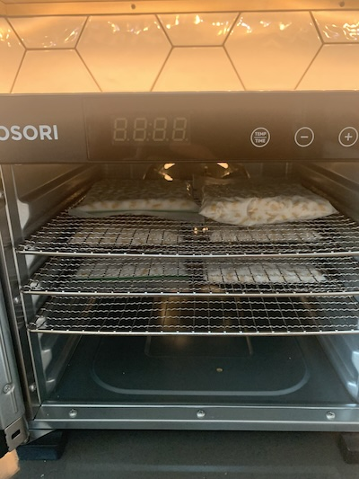
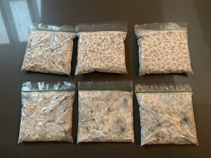

1. Soak 2 cups soybeans for 12 to 24 hours.
2. Cook in instant pot, 27 minutes plus natural release.
3. Heat and dry on stove.
4. Add vinegar and let the beans cool to around 95 degrees Fahrenheit.
5. Add tempeh starter powder, mix throughout carefully, without breaking up the beans too much
6. Punch holes in the ziploc bags. I punch a hole about every half inch.
7. Pack the beans into ziploc bags and make into sandwich-like thickness.
8. Place the bags in the dehydrators at 95 degrees for 24 hours.
9. After 24 hours, turn off the dehydrator. The beans should be able to keep themselves warm, as the ferment is active. Let sit another 24 or so hours until they're solid and done.

## Buying Tempeh Starter

Here's a big list of tempeh sellers from 2020 from [ferment.works](https://ferment.works/blog/2020/6/29/where-do-i-find-tempeh-starter-culture).
I've used this to find where to purchase Tempeh. For my first few batches, I used [Cultures for Health](https://culturesforhealth.com/), but it's really expensive. It makes sense to buy if you're just getting started, but it's best to look at other options after that.

For upcoming batches, I'm purchasing [62.5 grams of home grower tempeh starter](https://tempehlab.com/the-tempeh-lab-summertown-tn/tempeh-lab-starters/) from [Tempeh Lab](https://tempehlab.org/). Tempeh Lab also has an option for commercial grower tempeh starter, which is slightly cheaper and sold in larger quantities, but may be a slightly different product.

I tried purchasing [this](https://www.tempehstarter.com/zencart/index.php?main_page=product_info&cPath=1&products_id=1&zenid=j420h0qijr4ij5ln03848bpij2)
from [Tempeh Starter](https://www.tempehstarter.com/), but the payment was a link sent via email to Wise, which I had trouble completing and required connecting my bank account which felt unsafe.

## History of Tempeh

Tempeh is a traditional Indonesian food that dates back hundred of years. I highly encourage those interested to read at least a little bit of the history on [Wikipedia](https://en.wikipedia.org/wiki/Tempeh) to better understand the origins and be cognizant of appropriations.

## Cost Analysis

This recipe is for two cups of dried soybeans, which yields 925g grams of tempeh.

- Beans: $0.15[^1]
- Culture: $3.5[^2]
- Plastic baggies: $0.10
- Total: $3.75

A local brand of tempeh is packaged in 230g blocks and costs $6.
To compare, the house-made tempeh is $0.93 for the same amount of tempeh.

## Areas for Improvement

- Use something non-plastic for the wrappers, like banana leaves or corn husks.
- Make the soybeans in more quantity. Right now the limiting factor is that the Instant Pot can only make 2 cups of soybeans at once, and making the soybeans on the stove takes many hours.
- De-hull the beans more aggressively
- Find a budget-friendly tempeh starter.

## Can the starter be re-used?

I assume so but don't know how to do it. It seems that a lot of folks online struggle to re-use it, so use fresh starter each time (like [here](https://ferment.works/blog/2020/6/29/where-do-i-find-tempeh-starter-culture)).

This [video](https://www.youtube.com/watch?v=xUYRLg41VpA) from Yvonne Brilhart describes how to make Tempeh starter, so that'd be fun to try.

[^1]: Price from [Amazon](https://www.amazon.com/Soymerica-Non-GMO-Soybeans-Identity-Preserved/dp/B0763GC8SB?crid=RE14YQSNJYW4&keywords=soy+beans+dry&qid=1707888612&sprefix=soy+beans,aps,133&sr=8-4)

[^2]: The starter I'm currently using is not very budget friendly, and I'm going to move to buying in more bulk.
