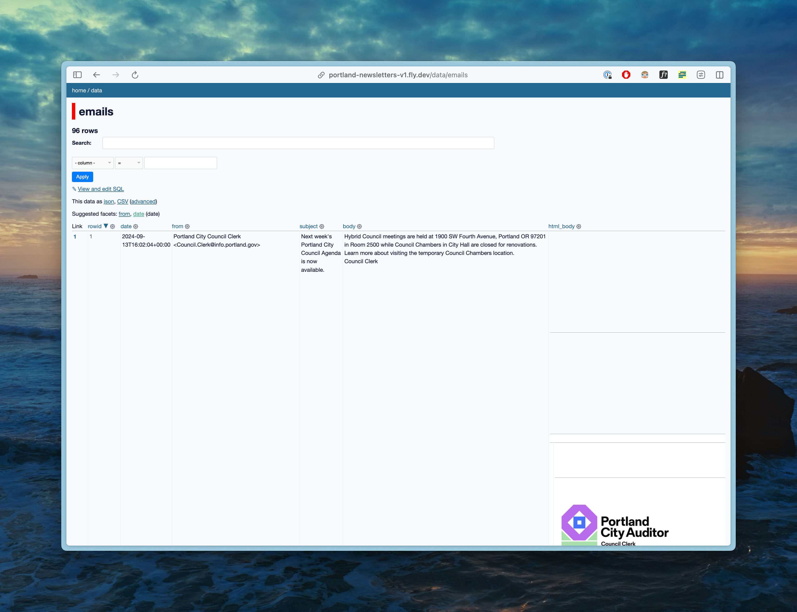

**Disclaimer: This is a quick side-project. It may or may not be maintained over time.**

**tl;dr: I'm building a prototype of an [archive of the City of Portland's newsletters](https://portland-newsletters-v1.fly.dev/data/emails).**

The City of Portland sends updates on many projects and programs via email, but lacks a searchable archive of past communications. This project aims to fill that gap by creating an accessible database of city newsletters.[^1]

The City of Portland uses GovDelivery to send email updates to residents. You can subscribe to these updates by visiting the [Gov Delivery Site](https://public.govdelivery.com/accounts/ORPORTLAND/subscriber/new).

The GovDelivery site allows you to choose from several topic categories, including:

- News and Events
- Projects and Plans
- Public Advisory Committees
- Portland in the Streets
- Safe Routes to School
- Sunday Parkways
- Parking and Regulatory

I’ve been unable to find an archive of the updates from the past - if you know of one, please let me know![^2]

I’ve signed up for all the email lists and am working on building an archive for the updates going forward for Portland residents. You can see my project here: [https://portland-newsletters-v1.fly.dev/data/emails](https://portland-newsletters-v1.fly.dev/data/emails).

### Current Features

- This includes all updates that I’ve collected over the last few months.
- Full-text search across subjects and email bodies
- A basic web interface for viewing the updates, using [Datasette](https://datasette.io/).

## Implementation

Getting the newsletters visible took a few false starts, but we eventually got there. I’m sure this approach isn’t final, but here’s where we’re at.

1. Collection
   1. I subscribed to all the newsletters to my personal email, which is hosted by Proton
   2. I use the [Proton CLI Mail Export Tool](https://proton.me/support/proton-mail-export-tool) to export every email to my computer
2. Processing
   1. I use a python script to parse the EML files and generate a JSON object that contains all the information. Each EML file results in a JSON file in a directory on disk. The EML files are parsed using python’s built in [mail](https://docs.python.org/3/library/email.html) library, and the plaintext bodies are extracted from HTML using [Trafilatura](https://trafilatura.readthedocs.io/).
   2. A second phase of the python script crawls the directory. The emails are filtered to only Portland newsletters and a CSV is generated with the final information.
3. Publishing
   1. The CSV is loaded into a sqlite database using [sqlite-utils](https://sqlite-utils.datasette.io/). And the full-text search is enabled on the subject and body columns.
   2. The sqlite database is published to [fly.io](http://fly.io) using [Datasette](https://datasette.io/).

### Ideas for Improvements

- Content Enhancement
  - Extract out the newsletter type for each email
  - Weekly newsletter summaries
  - Topic tagging (neighborhoods, departments)
  - Named entity recognition
- Interface and User Experience Improvements
  - A custom reading interface, perhaps inspired by Substack or RSS readers
  - Importance or relevance scoring, inspired by [https://www.newsminimalist.com/](https://www.newsminimalist.com/)
- Data Integration
  - Consider an integration with [Civic Band’s Portland city council minutes](https://oregon-metro.or.civic.band/meetings/minutes/)
  - Join the data with wikipedia or other data sources, like the Portland government website, so links to project information could be immediately available.
- Technical Onboarding Improvements
  - Make sure that same email has the same ID on subsequent runs
  - The current flow ignores attachments, so I need to investigate to see if attachments are ever included in the city emails.
  - I need to log into my email each time I run the Proton CLI tool, but I’d like to remove that step, which I assume can be done by using [1Password’s](https://1password.com/) CLI tool.
  - I’d love if I could send the emails to something like [Kill the Newsletter](https://kill-the-newsletter.com/) instead of my personal email, but I ran into various issues getting that working. I also tried setting up mail forwarding from my own email to Kill the Newsletter and also ran into a few issues.
  - If neither of those work, there might be an extractible utility here for Proton -> Datasette, which affords a read-only API for Proton emails, given that Proton doesn’t have an API.

[^1]: This is inspired by [Civic Band](https://civic.band/), which is a searchable archive of Portland city council meetings.

[^2]: You can reach me at hello at alexledger dot net.
