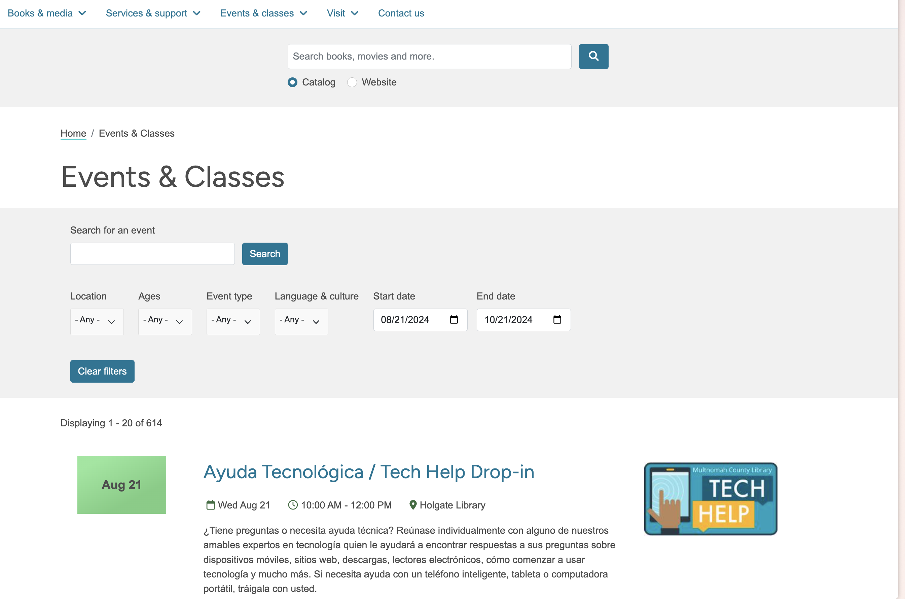
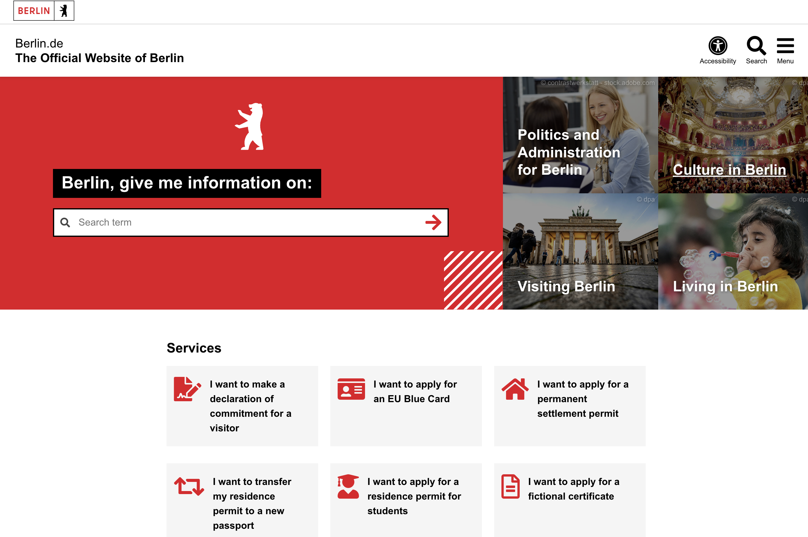

    <h2 style="margin-top: 0; padding-right: 0.5em; display: inline;">tl;dr</h2>
    
For fun, I critiqued, redesigned, and reworked the Multnomah County Library events page. My demo version is <a href="https://multco-library-events.netlify.app/">here</a>.

For fun, I critiqued, redesigned, and reworked the Multnomah County Library events page. This post goes over my approach and what I tried out, with a lot of discussion and brainstorming along the way.

(--> go straight to my [demo below](#my-code--using-my-demo))

## Starting with a critique

A few things I dislike on the current [Multnomah County Library events](https://multcolib.org/events-classes) page:

- The full-text search button has a separate search button that's distinct from the rest of the filters, so it's confusing and unclear how it interacts with the existing filters.
- There's also a site-wide and catalog search button above the event filters and page title, which can confuse users as to which searchbox to use.
- The event search button seems to only do full-word search. For example, "bili" doesn't yield any of the results for bilingual.
- Visually, the images next to the event entries don't offer much and feel like filler.
- I'd like to be able to click the location in an event description and get information about that library - like its hours, location, and so on.
- On large screen sizes, the date graphic on the left feels like a placeholder that wasn't finished.
- The date graphic draws my attention more than the title of the event
- The calendar graphic and image don't have rounded corners, but the buttons and text fields do, which confuses me.
- I wish I could easily link to all tech help events, so it'd be nice if filters were encoded in the URL and shareable.
- Clicking the register button doesn't always take me somewhere to register. For example, clicking Register for a Goodwill Industries class on Google Docs takes me here: https://events.multcolib.org/event/11374898&registration=true, which seems to be a page with event information.
- Language and culture should be different filters - it's odd to conflate the two concepts.

I researched events pages at other libraries across the world, and I was surprised by the general medium-low quality. Many basic cards, like the kind of cards that come out of the box with a component library, were used to show events in a list, which made it hard for eyes to skim through and find relevant events.

The public website I liked the most upon scanning was the city of Berlin's website, [https://www.berlin.de/en/](https://www.berlin.de/en/).
I love the search bar at the start - get me going somewhere, ala google's search design. And the animated header with Berlin-related imagery, like the standing bear, is really nice.

[Berlin's event page](https://www.berlin.de/en/tickets/) wasn't anything to write home about, but it was nice. It makes sense for them to use cards since they're displaying performance events, like a Childish Gambino concert, rather than a library event like Children's Storytime.

## My Approach and Mindset

I went forward with building my version of the event pages.

A few ideas I had going in:

1. Make the filters apply instantly
2. Support full-text search with prefix search, so "bili" returns results with "bilingual"
3. Make it easy and obvious to filter to locations

Design & Implementation Decisions:

1. Use checkboxes instead of dropdowns where possible.

I've noticed that less computer-savvy patrons tend to struggle with dropdowns because they need to click the dropdown, and then click the item. Often they butter-finger (is that term?) and select the wrong thing, which means they need to do the process again. I like checkboxes for this use-case because if they butter-finger and click the wrong thing, then (a) the remediation is to do the same action, as opposed to trying the dropdown flow again, and (b) they can click the location they want and worst case they get results for two locations instead of one.

That last idea is a UI/UX thing I've been thinking about with helping the patrons. The cost of a mistake, when possible, should be low and the best kinds of mistakes are the ones with basically no cost.

A good example of a low-cost mistake is in Google search where if a user searches for "olimpics", the results provided are for the "olympics", and their mistake was minimized to basically nothing. Let's build more form-like experiences like that, especially for operations that aren't sensitive like searching events.

2. Make scanning easy by putting pieces of information in predictable, consistent locations. This means putting dates and locations in consistent spots.

3. Make URLs shareable. When filters are added, update the URL so that libraries and patrons can share links with each other easily. This effectively auto-creates a primary "Lego Club" events page with all the lego club events.

4. Remove the images because they don't seem to offer much visual or informational value to users.

Things I didn't do that I'd want to do or explore in a full implementation

1. I didn't encode filters into the URL to support shareable URLs.
2. I didn't implement all the filters because I couldn't easily scrape all the data.
3. A better implementation would have made the filters foldable (Although I'm not totally convinced of this. The current library implementation folds the filters by default on mobile.)
4. I didn't implement pagination (which has the benefit of support control-f search)
5. I didn't determine which events had registration requirements versus learn more requirements.
6. I didn't implement the hyperlink for clicking on locations. This would either link to the library page or filter to just that library. I think the former is more predictable, but the latter is flashier.
7. Hot Filters(?)[^1] could have been cool. I'm imaging pills above the events that show common filters to click. Like "for kids" which would instantly filters to stuff for kids. I think google images does something like this to narrow searches after the initial search.

## My Code & Using My Demo

My demo[^2] is below. You can also try it directly at [https://multco-library-events.netlify.app/](https://multco-library-events.netlify.app/).

(Keep in mind it's a demo and none of the links will work.)

<iframe 
    src="https://multco-library-events.netlify.app/" 
    style="border: none; 
           width: 100%; 
           aspect-ratio: 1 / 1;
           box-shadow: 0 8px 16px rgba(0, 0, 0, 0.2); 
           border-radius: 2px; 
           overflow: hidden;">
</iframe>

The [code](https://github.com/aled1027/multco-library-redesign/) is written in Svelte and publicly available.

[^1]: There's probably an actual name for these, but I'll call them hot filters because they're fast, easy-to-apply and often based on search trends.

[^2]: I scraped the library events for August 14, 2024, through October 14, 2024, using a python script. I stored the events in a JSON file that's fetched & read client-side to render them.
