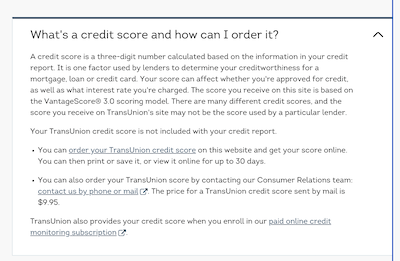
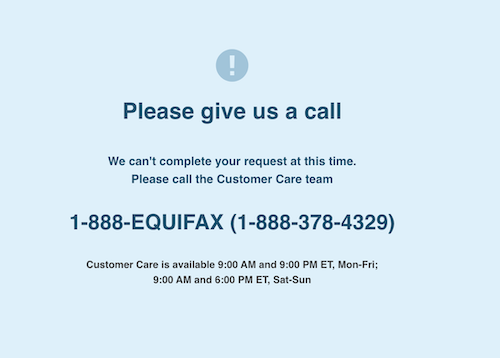
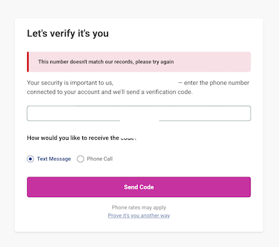

I recently froze and checked my credit with the three large credit agencies in the U.S., and I thought I'd share my experience so that it can assist others.

In general, it was a hard process to complete, and I'm still working on it, but there were a few bits that were easier than I expected. The last time that I checked with the three majors was probably in 2018, so it was due time to check-in and make sure my credit was frozen properly.

## CreditWise (Not one of the majors)

My primary means of monitoring my credit on the regular is [CreditWise](https://www.capitalone.com/creditwise/), Capital One's product which I get access to via my Capital One credit card. I've have a great experience with it, and I don't even remember needing to set anything up.

## TransUnion: Success!

TransUnion was an easy success on the whole. My log in from >5 years ago worked the first time, I 2-factored using my email, I requested a credit report which I got instantly, and I froze my credit, which hadn't been previously frozen.

However, I was not able to get my credit score from TransUnion, as it was a $10 charge that I didn't want to pay, especially since I effectively have it through CreditWise. I was pretty disappointed to see that it was an extra charge to get the score; I had assumed it was part of the requirements of the free credit report.

## Equifax: Failure :(

I've had the most challenges with Equifax. I remember 5 years ago when I tried never successfully making an account and calling their help line without success.

This time, I tried logging in using the email and password I had in 1pass, and I instantly got a message saying I needed to call them. It was not even a message saying my password was wrong or something like that, just that I need to call them.

## Experian: Failure :(

I thought that I had good success with Experian last check and that my credit was frozen, but this time I trouble. According to my 1pass entry, their login URL has changed from connect.experian.com to usa.experian.com, and also my 1password entry has an email and pin, but no password. So I wasn't even really sure how to log in.

I tried the forget my password to reset my password, assuming I had an account, but they said the phone number I entered doesn't match their records.

It's possible someone else has gained access for my account to Experian, but we'll need to see.

## My Recommendations

I'm not an expert, but here's what I recommend based on what I understand[^1].

1. Set up and use CreditWise, especially if you have a Capital One card. I've had a wonderful experience with CreditWise and it gives me peace of mind regarding my credit. On CreditWise, pay particular to attention to credit pulls and amount of credit: those will indicate if someone tried to open an account in your name.

2. Freeze your credit. It's hard, it takes time and grit, but it's got to be done.

3. Use a password manager. Losing access to these accounts is very annoying (I never really had access because I had issues at sign-up, but it'd be the same experience if you ost your password). You'll want to remember your passwords fore the future, and, because these passwords gateway access to your credit, the passwords need to be secure. I recommend [1Password](https://1password.com/) - I've been using it for years and love it.

4. Be careful clicking links and be skeptical of every website you visit! Even links when you google can be fraudulent, including and especially the sponsored links.

[^1]: I've been doing tech help sessions at my local library, which has prompted me to push through bureaucratic hurdles myself so that I'm better equipped to assist library patrons. Here and there, I'm also going to try to document my experiences and tips to assist others - and my future self.
