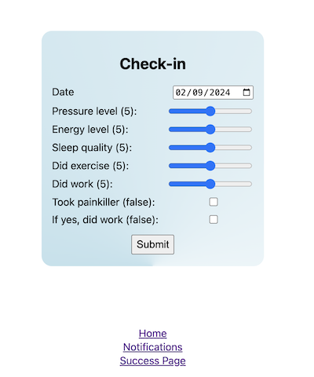

My partner has been having health issues for the last few months, and we wanted to start tracking how they're feeling and how various daily activities might be affecting them. They're an app-streak person, someone who's done Duolingo in the past, so I thought that in the spirit of [home-cooked apps](https://blakewatson.com/journal/magnoliajs-2023-the-joys-of-home-cooked-apps/), I'd whip up an app that:

1. Shows a form with a series of questions
2. Persists the data on submission
3. Notifies them once a day to fill out the form

I started by building a little website with Astro that had a basic form. I deployed the site with Netlify and enabled Netlify forms, which makes it so that when the form is submitted, the data is persisted on Netlify.[^1]

Finally, after some experimentation with PWAs, I set up notifications with [Ntfy](https://ntfy.sh) and GitHub actions so that there's a push notification to fill out the form once a day.

The source code for the website is publicly available [here](https://github.com/aled1027/check-in).

## The Daily Workflow

The daily workflow for the app is the following six steps:

1. A GitHub action is triggered on a schedule once a day which calls the Ntfy API to send a notification.[^2]
2. The Ntfy server receives the notification.
3. Ntfy uses web push to notify the phone app, which is subscribed to the topic.
4. User clicks the notification, navigating them to the check-in website.
5. The user fill outs the form on the check-in website and submits.
6. The form is submitted to Netlify forms, which persists the data.

## Notifications with Ntfy

[Ntfy](https://ntfy.sh) is the most exciting part of this project for me. It's "a simple HTTP-based pub-sub notification service" that makes sending notifications to phones, computers, or any device super easy with a REST API.[^3]

The gist is:

1. There's a topic that's any string; for example, it could be `mytopic123`.
2. A device subscribes to the topic, like with `curl -s ntfy.sh/mytopic123/json`.
3. Another device publishes to the topic, like with `curl -d "Hello :)" ntfy.sh/mytopic123`

I generated a random string for the topic so hopefully nobody else uses it. If someone does see the notification - because they are not private in this model - it's not a big deal because all they say is "Check in!".

On-click behavior (and more, check the docs) can be added to the notifications by adding this header: `"Click: https://my-app.pp/"` to the publish request. Then when the notification is clicked, the user is navigated to the url.

Finally, [Ntfy](https://ntfy.sh) has a free app, where you can subscribe to topics and get notifications, completing the picture.

## User Guide

The app isn't 100% self-contained since it relies on Ntfy for notifications, but set up isn't too challenging. The steps to set up are:

1. Install the [Ntfy](https://ntfy.sh) app and enable notifications
2. Subscribe to the topic

When the notification comes in, click it and navigate to the website. Fill out the form and be on your merry way :).

## Appendices

### Technologies Used

- Astro
- [Ntfy](https://ntfy.sh)
- Netlify for hosting
- Netlify Forms
- GitHub Actions

### PWAs and Why This Isn't a PWA

I started the app as a PWA because I wanted to support reminder push notifications. I was never able to get a simple push notification to show up in the PWA, (but I did get the simple push demo to work which is discussed below). Ultimately, I was going to need Web Push, not just notifications, which seemed like too much for this small project to me (see below) and that's how I ended up using [Ntfy](https://ntfy.sh).

By adding [ntfy.sh](ntfy.sh) I no longer needed any of the PWA features so I pulled it out.

Other than that, adding a PWA and making a native app vibe was pretty straightforward with Astro's [vite-pwa](https://github.com/vite-pwa/astro). I'd use it again for sure if needed.

### The iPhone API Notifications and Web Push Notification Was Hard for Me

I was able to get basic notifications working, like if a user clicks a button, I could send a notification. I was more daunted by web push notifications, which just seemed to require so much.

The best resource I found on the topic is https://simple-push-demo.vercel.app/. If I _need_ push notifications to use web push in a future project, this is the first place I'll look.

[^1]: This is my favorite way to make forms in prototypes.
[^2]: See https://github.com/aled1027/check-in/blob/main/.github/workflows/notify.yml
[^3]: Quotation from [https://ntfy.sh/](https://ntfy.sh/)
